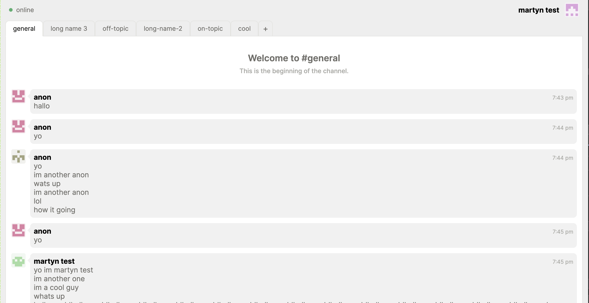

# rust-peerboard


A peer-to-peer distributed bulletin board with Battleship functionality.

This is a [Ratatui] app generated by the [Hello World template].

[Ratatui]: https://ratatui.rs
[Hello World Template]: https://github.com/ratatui/templates/tree/main/hello-world

## How to build and run

To run, from the repository root, run

```
cargo run
```

## Functionality

Hello, world
